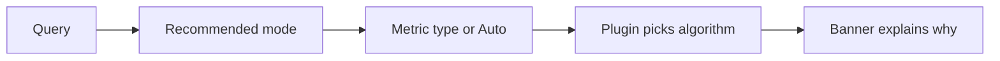

# Grafana Anomaly Detector Kullanim Ozeti

## 1. Ne Hazirlandi?

Bu proje, WSL Ubuntu icinde calisan Grafana 12.4.1 uzerinde gelistirilmis bir custom panel plugin'dir.

- Plugin id: `alpas-anomalydetector-panel`
- Author: `Alpaslancetin`
- Demo folder: `Anomaly Demo`
- TestData dashboard: `Provisioned Anomaly Detector Demo`
- Prometheus dashboard: `Prometheus Live Anomaly Demo`

## 2. Yeni Kullanim Mantigi

Panel artik iki farkli kullanim seviyesine sahip:

- `Recommended`: user metric tipini secer, plugin algoritmayi ve ayarlari otomatik belirler
- `Advanced`: user algoritmayi ve threshold gibi ayarlari elle secer

Hedef su: kullanici `MAD mi EWMA mi` diye dusunmek zorunda kalmasin.

## 3. User Ne Yapar?

Yeni bir panel actiginda pratik akis su sekildedir:

1. Datasource sec
2. PromQL veya diger query'ni yaz
3. Visualization olarak `Anomaly Detector` sec
4. `Setup mode = Recommended` birak
5. `Metric type` sec ya da `Auto` birak
6. Panelin ustundeki recommendation banner'ina bak



## 4. Recommendation Banner Ne Ise Yariyor?

Panelin ustunde artik gorunen bir recommendation banner var.

Bu banner su soruya cevap verir:

- `Hangi algoritma secildi?`
- `Neden secildi?`
- `Su an hangi tuning aktif?`

Ornek davranis:

- `Auto chose Latency / duration`
- `Latency metrics are often spiky and outlier-heavy, so MAD is more robust...`
- `Current tuning: Rolling MAD | threshold 2.40 | severity Page first`

Yani user sadece sonuca degil, secimin mantigina da bakar.

## 5. Setup Mode'lar

### Recommended

Bu mod varsayilan moddur.

- algoritma secimi gizlidir
- threshold ve ileri ayarlar gizlidir
- user sadece metric tipini secerek ilerler
- panel uygun algorithm, threshold, seasonal refinement ve severity preset'i otomatik uygular

### Advanced

Bu mod manuel kontrol isteyen user icindir.

- `Algorithm`
- `Anomaly threshold`
- `History window`
- `Seasonal refinement`
- `Severity preset`

alanlari acilir.

## 6. Metric Type / Preset Secenekleri

- `Auto`: metric adina bakip secim yapar
- `Traffic / throughput`: request rate, throughput, volume
- `Latency / duration`: p95, p99, latency, response time
- `Error rate`: hata orani ve patlayan failure metric'leri
- `Resource usage`: CPU, memory, load, saturation
- `Business KPI`: siparis, signup, revenue gibi dongusel KPI'lar

## 7. Auto Nasil Karar Veriyor?

`Auto`, query'den gelen metric isimlerine ve field adlarina bakar.

Ornek anahtar kelimeler:

- `latency`, `duration`, `response`, `p95`, `p99` -> `Latency / duration`
- `error`, `failure`, `timeout`, `5xx` -> `Error rate`
- `cpu`, `memory`, `load`, `disk` -> `Resource usage`
- `revenue`, `orders`, `signup`, `checkout` -> `Business KPI`
- `requests`, `throughput`, `traffic`, `rps` -> `Traffic / throughput`

Eger guclu bir eslesme bulamazsa, `Auto` guvenli baslangic olarak `Traffic / throughput` ile baslar.

## 8. Hangi Metric Tipi Hangi Algoritmaya Gider?

Plugin'in onerilen eslestirmesi su sekildedir:

- `Traffic / throughput` -> `EWMA`
- `Latency / duration` -> `MAD`
- `Error rate` -> `MAD`
- `Resource usage` -> `EWMA`
- `Business KPI` -> `Seasonal`

Bu sayede user'in algoritma bilgisi olmasa da iyi bir ilk sonuc alinir.

## 9. Ne Zaman Advanced Moda Gecmeliyim?

Sadece su durumlarda:

- bilincli olarak farkli algoritma denemek istiyorsan
- false positive / false negative ayari yapmak istiyorsan
- seasonal refinement'i elle belirlemek istiyorsan
- paging icin severity davranisini ozel ayarlamak istiyorsan

Normal dashboard kullaniminda once `Recommended` ile baslamak daha dogrudur.

## 10. Dashboard'ta Ne Goreceksin?

- Ust kisim: anomaly chart, beklenen deger cizgisi ve dalga gibi beklenen aralik bandi
- Sag ust kartlar: series sayisi, anomaly sayisi, peak score, alert severity
- Recommendation banner: secilen preset ve algoritmanin nedeni
- Chart uzerindeki anomaly marker'lari tiklanabilir; score, expected value, deviation ve expected range acilir
- Alt kisim: top anomalies, selected anomaly, how it works
- Export bloklari varsayilan olarak aciktir; istenirse panel ayarindan kapatilabilir

## 11. TestData Demo

`Provisioned Anomaly Detector Demo` kontrollu ve sabit bir ornektir.

Bu demo bilerek `Advanced` modda tutuldu; boylece manuel z-score mantigini gormek kolay olur.

## 12. Prometheus Live Demo

Canli demo ortami:

- Prometheus adresi: `http://localhost:9091`
- Grafana datasource: `Prometheus Live Demo`
- Aktif metric'ler:
  - `demo_latency_ms`
  - `demo_requests_per_second`
  - `demo_error_rate_percent`

Provisioned dashboard'da hazir gelen kullanim:

- ust panel: `setupMode=recommended`, `metricPreset=latency`
- orta panel: `setupMode=recommended`, `metricPreset=traffic`
- alt panel: referans time series gorunumu

## 13. Kendi Prometheus Metric'inde Nasil Kullanirim?

1. Yeni panel ac
2. Datasource olarak Prometheus sec
3. Query'ni yaz
4. Visualization olarak `Anomaly Detector` sec
5. `Setup mode = Recommended` birak
6. Once `Metric type = Auto` dene
7. Recommendation banner'daki nedeni oku
8. Gerekirse `Latency`, `Traffic`, `Error rate` gibi presetlerden birini elle sec
9. Hala ihtiyac varsa `Advanced` moda gec

Ornek sorgular:

```promql
rate(http_requests_total[5m])
```

```promql
histogram_quantile(0.95, sum(rate(http_request_duration_seconds_bucket[5m])) by (le, job))
```

```promql
sum(rate(container_cpu_usage_seconds_total[5m])) by (pod)
```

## 14. Seasonal ve Severity Mantigi

Seasonal algoritma uc sekilde calisabilir:

- `Cycle only`
- `Hour of day`
- `Weekday + hour`

Severity preset secenekleri:

- `Balanced`
- `Warning first`
- `Page first`

Ama bunlar artik genelde `Recommended` mod tarafindan otomatik secilir. Elle degistirmek istersen `Advanced` moda gecersin.

## 15. Export Bloklari

Panelin altinda iki yardimci blok vardir ve varsayilan olarak gorunur:

- `Annotation export`: anomaly olaylarinin event ozeti
- `Alert rule export`: aktif setup'a gore alert taslagi

Istersen panel ayarlarindan `Show export blocks` secenegini kapatabilirsin.

Bunlar bugun icin copy-friendly yardimci formatlardir; dogrudan Grafana API'ye yazmazlar.

## 15A. Bucket Span Ne Demek?

`Bucket span`, canli veya cok yogun veriyi anomali hesaplamasindan once toplastirma araligidir.

- `Auto`: veri yogunluguna gore verimli araligi secmeye calisir
- `Raw samples`: her noktayi ayri skorlar
- `1m`, `5m`, `15m`, `1h`: once bu aralikta toplastirir, sonra anomali analizi yapar

Canli Prometheus akisi ve buyuk dashboard'larda genelde `Auto` en pratik secenektir. Kucuk ve detayli incelemelerde `Raw samples` daha anlamlidir.

## 16. Gelistirme Komutlari

```bash
cd /mnt/c/Users/alpas/Documents/CodexSample/grafana-anomaly-lab/alpas-anomalydetector-panel
npm run dev
npm run build
sudo systemctl restart grafana-server
```

## 17. Teknik Referanslar

- Panel ayarlari: `src/module.ts`
- Panel mantigi: `src/components/SimplePanel.tsx`
- Tipler: `src/types.ts`
- TestData demo dashboard: `provisioning/dashboards/dashboard.json`
- Prometheus demo dashboard: `provisioning/dashboards/prometheus-live-dashboard.json`


## 12A. Prometheus Score Feed (No YAML)

Panel artik kendi icinde bir `Prometheus score feed` karti gosterir.

Buradaki amac su:
- user anomaly paneli tanimlar
- plugin bu panel tanimini exporter'a sync eder
- exporter Prometheus icin `grafana_anomaly_rule_score` ve `grafana_anomaly_score` metric'leri uretir
- user alert rule ekraninda dogrudan bu score metric'lerini kullanir

Kullanici artik normal akista su dosyalara girmez:
- `prometheus.yml`
- `anomaly_exporter/rules.yml`

### Score feed mode secenekleri

- `Auto sync`: kaydedilmis dashboard tanimini izler, save sonrasi score rule'lari otomatik gunceller
- `Manual sync`: panel icindeki `Sync score feed` butonuyla ayni isi elle tetikler
- `Off`: bu panel icin score feed kapali olur

Pratik onerilen kullanim:
1. Paneli Prometheus query ile hazirla
2. `Score feed mode = Auto sync` birak
3. Dashboard'u kaydet
4. Paneldeki `Prometheus score feed` kartinda uretilen alert query'yi gor
5. Alerting ekraninda bu query ile threshold tanimla

## 15B. Alert Rule'u Artik Nasil Tanimlarim?

Panelde `Prometheus score feed` karti sync basarili oldugunda sana hazir query verir.

Ornek:
```promql
grafana_anomaly_rule_score{rule="checkout_latency_panel"}
```

Grafana alert rule akisi:
1. `Alerting -> Alert rules -> New alert rule`
2. Datasource olarak Prometheus sec
3. Panelin verdigi `grafana_anomaly_rule_score{rule="..."}` query'sini kullan
4. Condition olarak `IS ABOVE 70` gibi bir esik koy
5. `For = 2m` veya `5m` sec
6. Contact point bagla

Daha detayli ihtiyac icin panel kartinda ayrica series-level query de gorunur:
```promql
grafana_anomaly_score{rule="checkout_latency_panel"}
```

Bu da instance veya seri bazli alert tasarlamak icin kullanilir.
