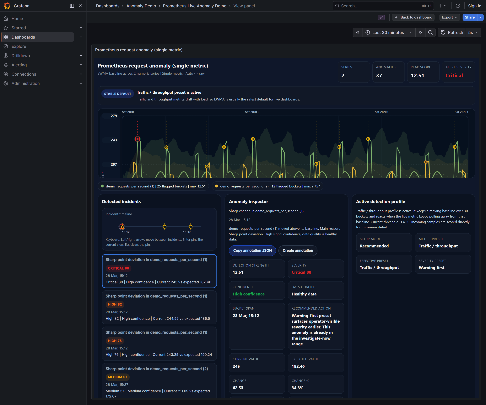
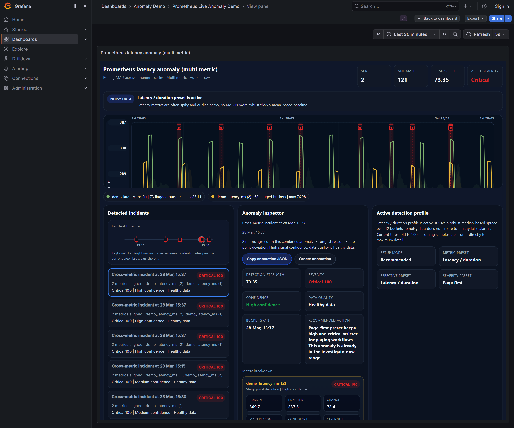
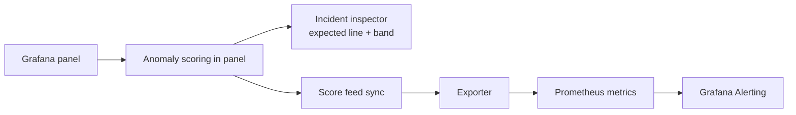

# Grafana Anomaly Detector

<p align="center">
  <strong>An anomaly detection panel for Grafana with an optional Prometheus score-feed exporter for alerting.</strong>
</p>

<p align="center">
  Detect anomalies inside the panel, inspect why they were flagged, and publish alert-ready scores without maintaining custom Prometheus rule files for each dashboard.
</p>

<p align="center">
  
  
  
  
</p>

---

## ✨ Why this project stands out

- **Panel-native anomaly detection**: analyze time-series directly where operators already work.
- **Readable anomaly context**: expected value, deviation, confidence, data quality, and main reason are surfaced in the UI.
- **Alert-ready score feed**: sync panel settings to an exporter and expose Prometheus metrics for Grafana Alerting.
- **Multiple scoring models**: `zscore`, `mad`, `ewma`, `seasonal`, and `level_shift`.
- **Test-backed compatibility**: validated with live responsive and score-feed flows on Grafana `11.6.7` and `12.4.1`.

## 🧭 At a glance

| Area | What you get |
| --- | --- |
| Panel UX | Recommended mode, Advanced mode, incident inspector, expected line and band, focused anomaly view |
| Detection | Multi-algorithm scoring, severity mapping, confidence scoring, data quality awareness |
| Operations | Prometheus score feed, alert-ready metric queries, exporter bundles, rollout packages |
| Delivery | Source code, live demo stack, release zips, GitHub release notes |

## 🖼️ Product view

<table>
  <tr>
    <td width="50%">
      
    </td>
    <td width="50%">
      
    </td>
  </tr>
  <tr>
    <td align="center"><strong>Single metric inspection</strong></td>
    <td align="center"><strong>Multi-metric incident reading</strong></td>
  </tr>
</table>

<p align="center">
  
</p>

<p align="center">
  <strong>Score feed and operational export block</strong>
</p>

## 🔄 How it works



### Detection flow

1. Open a Grafana panel with numeric time-series data.
2. Choose `Recommended` for guided defaults or `Advanced` for manual tuning.
3. The panel computes an expected baseline and flags anomalies.
4. Operators inspect the anomaly story inside the panel.
5. If needed, the panel syncs rule metadata to the exporter.
6. The exporter publishes Prometheus metrics such as `grafana_anomaly_rule_score`.

## 🚨 Score feed exporter

The exporter turns panel-side anomaly settings into Prometheus metrics that can be used in Grafana Alerting or any Prometheus-compatible alerting stack.

**Exporter source**

- [`prometheus-live-demo/anomaly_exporter/`](prometheus-live-demo/anomaly_exporter)

**Main exported metrics**

- `grafana_anomaly_rule_score`
- `grafana_anomaly_score`
- `grafana_anomaly_confidence_score`

**Important behavior**

- The score feed is a **live rolling detector**, not a replay of the selected dashboard time range.
- Exported scores are produced from:
  - synced rule configuration
  - PromQL lookback in the query itself
  - exporter-side rolling history
- Removing a dashboard does **not** automatically clean synced exporter rules.

## 🧱 Repository layout

| Path | Purpose |
| --- | --- |
| [`grafana-anomaly-detector-panel/`](grafana-anomaly-detector-panel) | Plugin source code |
| [`prometheus-live-demo/`](prometheus-live-demo) | Local demo stack with Prometheus and exporter flow |
| [`release/`](release) | Release packages and GitHub release notes |
| [`assets/readme/`](assets/readme) | README visuals |

## ✅ Compatibility

### Minimum supported Grafana version

This release line requires **Grafana `11.6.7` or later**.

The plugin manifest declares:

- `grafanaDependency: >=11.6.7`

### Live validated Grafana versions

- `11.6.7`
- `12.4.1`

### Validated scenarios

- full dashboard rendering
- `viewPanel` rendering
- `d-solo` rendering
- narrow viewport behavior
- resize and redraw behavior
- score-feed sync and exporter rule registration

## ⚙️ Requirements

### Runtime

- Grafana `>= 11.6.7`
- Prometheus, only if you want score-feed based alerting

### Development

- Node.js `22+`
- npm `10+`

## 🚀 Quick start

### Plugin development

```bash
cd grafana-anomaly-detector-panel
npm install
npm run dev
```

Useful commands:

```bash
npm run build
npm run typecheck
npm run test:ci
npm run e2e
```

### Local live demo

```bash
cd prometheus-live-demo
docker compose up --build
```

Typical local endpoints:

- Grafana: `http://localhost:3000`
- Prometheus: `http://localhost:9091`
- Exporter metrics: `http://localhost:9110/metrics`

## 📦 Release packages

Main outputs under [`release/`](release):

- `grafana-anomaly-detector-plugin.zip`
- `grafana-anomaly-detector-alert-bundle.zip`
- `grafana-anomaly-detector-alert-bundle-python39.zip`

Release package notes:

- [`release/README.md`](release/README.md)
- [`release/GITHUB_RELEASE_NOTES_v1.2.0.md`](release/GITHUB_RELEASE_NOTES_v1.2.0.md)

## 🛠️ Typical alerting path

1. Build an anomaly panel in Grafana.
2. Enable `Score feed mode`.
3. Sync the panel to the exporter.
4. Query `grafana_anomaly_rule_score{rule="..."}` from Prometheus.
5. Use that metric in Grafana Alerting.

## 📚 More detail

<details>
  <summary><strong>What does the panel expose in the UI?</strong></summary>

- expected value and expected band
- severity label and numeric score
- confidence label and confidence score
- data quality state
- main reason for the anomaly decision
- anomaly inspector and export helpers

</details>

<details>
  <summary><strong>Why keep the plugin ID as <code>alpas-anomalydetector-panel</code>?</strong></summary>

The public repository and package names use neutral naming, but the plugin ID is kept stable for compatibility with existing Grafana installations and upgrade flows.

</details>

<details>
  <summary><strong>Where should I start if I only want to evaluate the project?</strong></summary>

Start with:

- the screenshots above
- [`prometheus-live-demo/`](prometheus-live-demo)
- [`release/`](release)

</details>

## License

This project is licensed under Apache-2.0. See [LICENSE](LICENSE).
