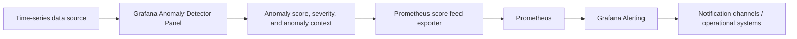
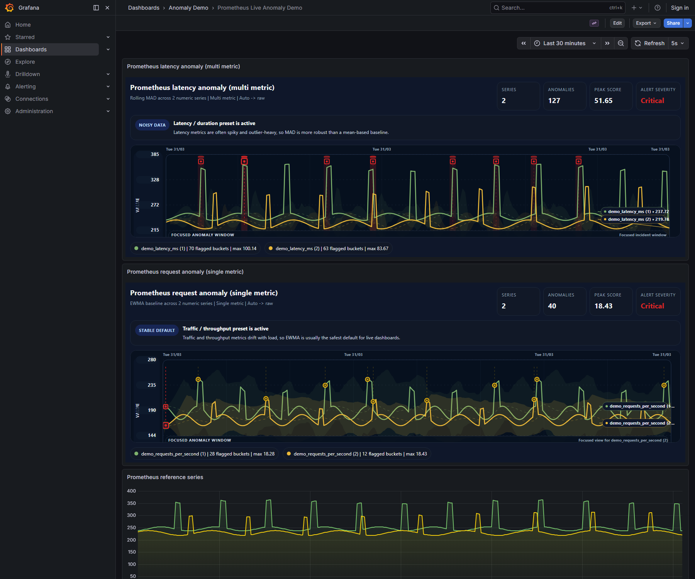
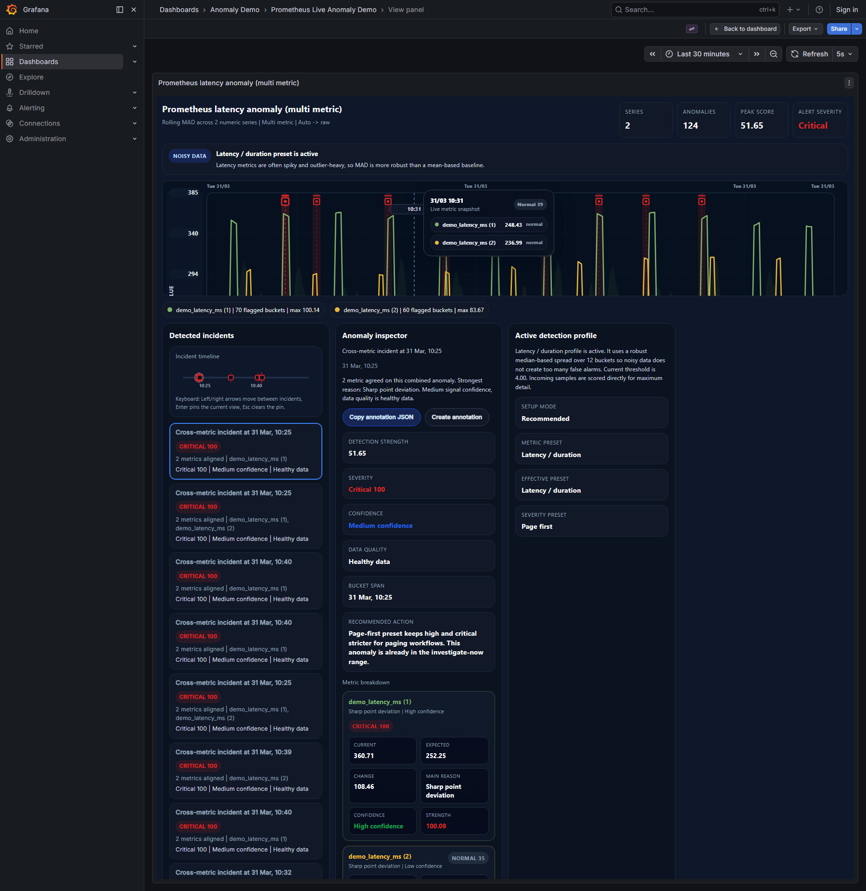

# Grafana Anomaly Detector Lab

A production-oriented Grafana anomaly detection toolkit that combines a custom panel plugin, a Prometheus score-export pipeline, benchmark assets, demo environments, and release bundles for Red Hat based deployments.

This repository covers the full journey from visual anomaly inspection inside a Grafana panel to operational alerting with Prometheus-backed Grafana Alerting. It includes plugin source code, a live demo stack, benchmark and comparison material, release-ready installation packages, and detailed end-user documentation with screenshots and walkthrough assets.

## Release snapshot

Current highlighted release line:

- Plugin: `1.2.0`
- Grafana validation target: `12.4.1`
- Panel plugin ID: `alpas-anomalydetector-panel`
- Exporter support: Prometheus score feed with confidence score metrics
- Delivery model: plugin-only package and alert-bundle package

## What this repository delivers

- A custom Grafana panel plugin for anomaly detection on time-series data
- Guided `Recommended` mode and expert-oriented `Advanced` mode
- Multiple scoring models including `zscore`, `mad`, `ewma`, `seasonal`, and `level_shift`
- In-panel anomaly inspection with expected value, deviation, confidence, data quality, and main-reason context
- Annotation and alert export helpers for operational workflows
- A Prometheus score feed pipeline that turns anomaly signals into alertable metrics
- Benchmark assets and side-by-side comparison material for Grafana detector vs Elastic ML
- Release bundles and runbooks for native Red Hat deployments
- A complete tutorial set with screenshots, PDF guide, and walkthrough media

## Core capabilities

### Panel experience

- Recommended mode auto-selects a sensible preset based on metric behavior
- Advanced mode exposes manual control over algorithm, threshold, window, and severity behavior
- Expected line and expected band are rendered directly on the chart
- Clicking an anomaly opens deeper bucket-level context
- Chart readability improvements include severity marker shapes, inline series labels, focus band, hover crosshair, and pinned tooltip
- Export helpers expose operational snippets for annotations, alerting, and score-feed workflows

### Detection models

- `zscore`
- `mad`
- `ewma`
- `seasonal`
- `level_shift`

### Seasonal refinements

- `cycle`
- `hour_of_day`
- `weekday_hour`

### Metric presets

- `auto`
- `traffic`
- `latency`
- `error_rate`
- `resource`
- `business`
- `subtle_level_shift`

### Score feed and alerting

- Publishes anomaly scores as Prometheus metrics
- Supports dashboard-driven sync flows for score rules
- Exposes alert-ready metrics such as `grafana_anomaly_rule_score`, `grafana_anomaly_score`, and `grafana_anomaly_confidence_score`
- Enables Grafana Alerting rules without maintaining large manual YAML rule sets for day-to-day use

## End-to-end architecture



## Repository layout

| Path | Purpose |
| --- | --- |
| `alpas-anomalydetector-panel/` | Source code of the custom Grafana panel plugin |
| `prometheus-live-demo/` | Demo stack for Prometheus-backed anomaly score export |
| `benchmarks/` | Functional, performance, soak, and Elastic side-by-side benchmark artifacts |
| `release/` | Shareable release bundles, installation scripts, and runbooks |
| `tutorial/` | End-to-end tutorial, screenshots, PDF guide, and walkthrough assets |
| `deliverables/` | Presentation and packaging-oriented project outputs |
| `KULLANIM_OZETI_TR.md` | Turkish usage summary |
| `ALERTING_TR.md` | Turkish alerting guide |

## Benchmark and evaluation material

The repository includes benchmark material used to evaluate both product quality and operational behavior.

Highlights:

- Functional benchmark scenarios with labeled anomaly windows
- Elastic ML side-by-side comparison flow
- Performance, load, and soak test packages
- Executive and technical presentation decks
- Final benchmark report and benchmark README set

Key locations:

- `benchmarks/Final_Benchmark_Raporu_TR.md`
- `benchmarks/README_TR.md`
- `benchmarks/elastic_side_by_side/`
- `benchmarks/presentation/`

## Screenshots

### Prometheus-backed anomaly dashboard



### Selected anomaly and operator workflow



## Quick start

### 1. Plugin development

Requirements:

- Node.js `22+`
- npm `10+`
- Grafana `12.4.x`

Run the panel locally:

```bash
cd alpas-anomalydetector-panel
npm install
npm run dev
```

Useful commands:

```bash
npm run build
npm run typecheck
npm run lint
npm run test:ci
npm run e2e
```

### 2. Prometheus live demo

The live demo stack lives under `prometheus-live-demo/` and provides:

- synthetic metrics
- anomaly exporter
- Prometheus scrape configuration
- Grafana-ready score metrics

Start it with Docker Compose from the demo folder:

```bash
cd prometheus-live-demo
docker compose up --build
```

Default local endpoints used in the project:

- Grafana: `http://localhost:3000`
- Prometheus: `http://localhost:9091`
- Exporter metrics: `http://localhost:9110/metrics`

### 3. Production-style installation

Release-ready artifacts are packaged under `release/`.

Main outputs:

- `release/alpas-anomalydetector-panel-plugin-only.zip`
- `release/alpas-anomaly-alert-bundle.zip`
- `release/alpas-anomaly-alert-bundle-python39-compatible.zip`
- `release/RHEL_KURULUM_RUNBOOK_TR.md`
- `release/RHEL_REMOTE_PROMETHEUS_RUNBOOK_TR.md`

These packages support a Red Hat oriented path with:

- native plugin installation
- exporter systemd service deployment
- Prometheus scrape integration
- Grafana alerting on anomaly score metrics

## Alerting workflow

1. Build a Prometheus-backed anomaly panel in Grafana
2. Let the score feed sync generate or refresh rule metrics
3. Query `grafana_anomaly_rule_score{rule="..."}` in Grafana Alerting
4. Add a threshold such as `IS ABOVE 70`
5. Attach the desired contact point

This keeps the anomaly detection experience inside the panel while exposing a stable operational metric for downstream alerting.

## Documentation

End-user and operator documents already included in this repository:

- [Detailed Turkish tutorial (HTML)](tutorial/Anomaly_Detector_End_to_End_TR.html)
- [Detailed Turkish tutorial (PDF)](tutorial/Anomaly_Detector_End_to_End_TR.pdf)
- [Turkish usage summary](KULLANIM_OZETI_TR.md)
- [Turkish alerting guide](ALERTING_TR.md)
- [Technical evaluation and test plan](Anomaly_Detector_Teknik_Degerlendirme_ve_Test_Plani_TR.md)
- [Roadmap and next steps](Anomaly_Detector_Sonraki_Adimlar_ve_Yol_Haritasi_TR.md)
- [Release package guide](release/README_TR.md)
- [Red Hat installation runbook](release/RHEL_KURULUM_RUNBOOK_TR.md)
- [Remote Prometheus runbook](release/RHEL_REMOTE_PROMETHEUS_RUNBOOK_TR.md)

## Project status

This repository currently focuses on:

- Grafana Enterprise `12.4.1` based validation
- operational anomaly score export for Prometheus
- benchmark-backed product tuning
- ready-to-share release bundles for controlled installations
- guided documentation for panel usage, alerting, and rollout flows

## License

This project is licensed under Apache-2.0. See [LICENSE](LICENSE).
