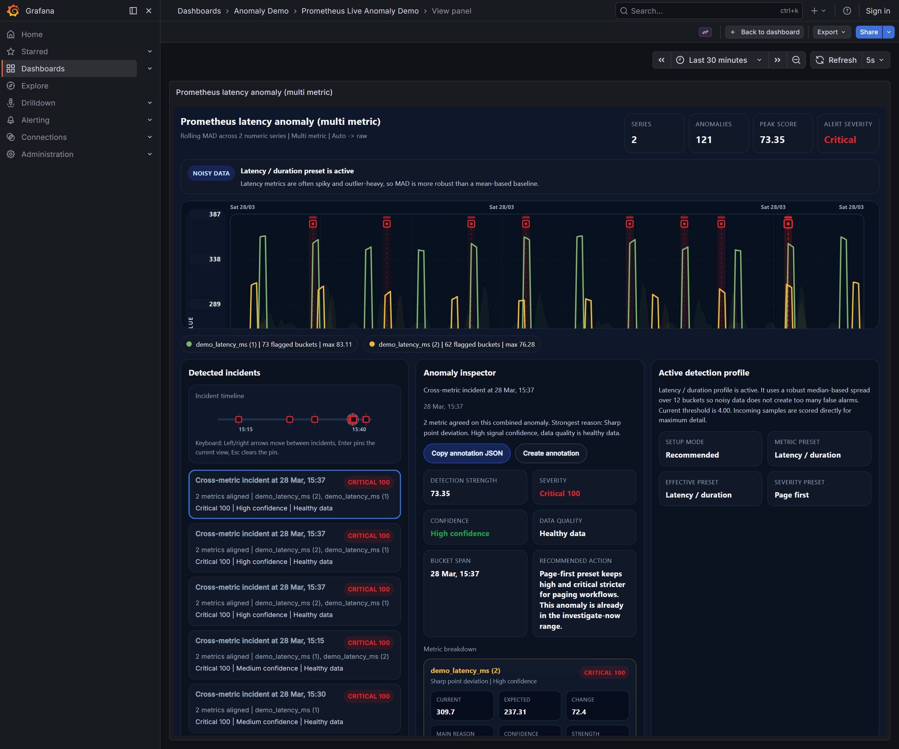
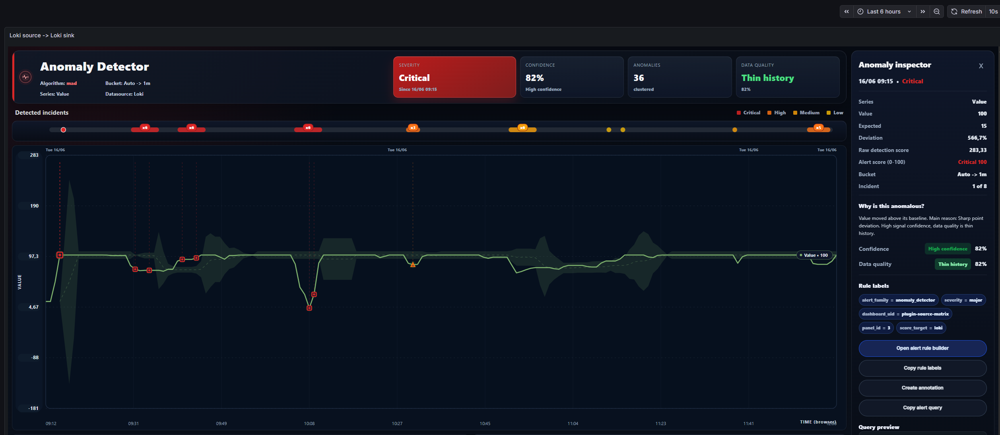
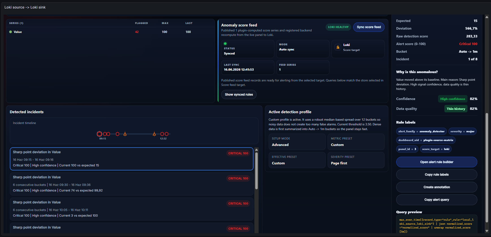
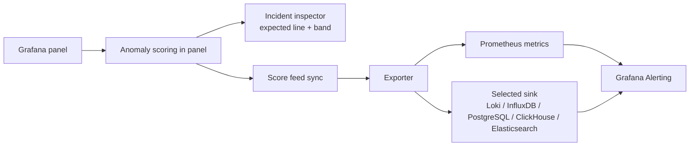

# Grafana Anomaly Detector

<p align="center">
  <strong>An anomaly detection panel for Grafana with a multi-target score-feed exporter for alerting.</strong>
</p>

<p align="center">
  Detect anomalies inside the panel, inspect why they were flagged, and publish alert-ready scores without maintaining custom Prometheus rule files for each dashboard.
</p>

<p align="center">
  
  
  
  
</p>

---

## Current release: v1.5.0

Plugin **1.5.0**, exporter **1.5.0**, API schema **3**. Download the matched packages from the [v1.5.0 release](https://github.com/alpaslancetin/grafana-anomaly-detector/releases/tag/v1.5.0), then follow the [current installation and upgrade guide](release/GRAFANA_ANOMALY_DETECTOR_E2E_KURULUM_UPGRADE_KILAVUZU_v1.5.0_TR.md).

See [release scope and remaining work](release/STATUS_v1.5.0.md) for verified coverage and limitations. The plugin is unsigned; full native Grafana Time Series chart parity is not claimed.

## ✨ Why this project stands out

- **Panel-native anomaly detection**: analyze time-series directly where operators already work.
- **Readable anomaly context**: expected value, deviation, confidence, data quality, and main reason are surfaced in the UI.
- **Alert-ready score feed**: publish plugin-computed scores to Prometheus metrics or a selected datasource sink.
- **Multiple scoring models**: `zscore`, `mad`, `ewma`, `seasonal`, and `level_shift`.
- **Test-backed compatibility**: validated with live responsive and score-feed flows on Grafana `11.6.7` and `12.4.0`.

## 🧭 At a glance

| Area | What you get |
| --- | --- |
| Panel UX | Recommended mode, Advanced mode, incident inspector, expected line and band, focused anomaly view |
| Detection | Multi-algorithm scoring, severity mapping, confidence scoring, data quality awareness |
| Operations | Multi-target score feed, alert-ready metric records, exporter bundles, rollout packages |
| Delivery | Source code, live demo stack, release zips, GitHub release notes |

## 🖼️ Product view

These screenshots illustrate the product workflow; they are not a pixel-by-pixel acceptance baseline for v1.5.0. Refer to the current guide and release scope for supported controls.

<table>
  <tr>
    <td width="50%">
      
    </td>
    <td width="50%">
      
    </td>
  </tr>
  <tr>
    <td align="center"><strong>Single metric inspection</strong></td>
    <td align="center"><strong>Multi-metric incident reading</strong></td>
  </tr>
</table>

<p align="center">
  
</p>

<p align="center">
  <strong>Score feed and operational export block</strong>
</p>

<table>
  <tr>
    <td width="50%">
      
    </td>
    <td width="50%">
      
    </td>
  </tr>
  <tr>
    <td align="center"><strong>Loki source detection and inspector</strong></td>
    <td align="center"><strong>Loki score sink and target-aware LogQL</strong></td>
  </tr>
</table>

## 🔄 How it works


```mermaid
flowchart LR
    A["Grafana panel"] --> B["Anomaly scoring in panel"]
    B --> C["Incident inspector<br/>expected line + band"]
    B --> D["Score feed sync"]
    D --> E["Exporter"]
    E --> F["Prometheus metrics"]
    E --> H["Selected sink<br/>Loki / InfluxDB / PostgreSQL / ClickHouse / Elasticsearch"]
    F --> G["Grafana Alerting"]
    H --> G
```

### Detection flow

1. Open a Grafana panel with numeric time-series data.
2. Choose `Recommended` for guided defaults or `Advanced` for manual tuning.
3. The panel computes an expected baseline and flags anomalies.
4. Operators inspect the anomaly story inside the panel.
5. Save the dashboard, select one score target, and sync the source query and detection settings to the exporter.
6. The exporter recomputes registered rules from the source without an open browser and publishes alert scores to the selected target. Panel snapshots provide a preview; continuous alerting requires a registered, exporter-readable source and healthy dependencies.

## 🔌 Plugin installation

If you only want the panel plugin, you do not need the exporter bundle.

**Release package**

- [`release/grafana-anomaly-detector-plugin.zip`](release/grafana-anomaly-detector-plugin.zip)

**Typical Grafana install flow**

1. Extract or copy the `alpas-anomalydetector-panel` plugin directory into your Grafana plugins path.
2. Keep the unsigned plugin allow-list entry:
   - `allow_loading_unsigned_plugins = alpas-anomalydetector-panel`
3. Restart Grafana.
4. Hard refresh the browser after the restart.

**Typical Linux path**

- `/var/lib/grafana/plugins/alpas-anomalydetector-panel`

**Minimal config note**

```ini
[plugins]
allow_loading_unsigned_plugins = alpas-anomalydetector-panel
```

## 🚨 Score feed exporter

The exporter registers saved panel queries, recomputes their anomaly scores independently of the browser, and accepts panel preview snapshots. A panel selects one target: Prometheus metrics, Loki, InfluxDB, PostgreSQL, ClickHouse, or Elasticsearch. Prometheus is not required when neither the source nor the target is Prometheus.

**Exporter source**

- [`prometheus-live-demo/anomaly_exporter/`](prometheus-live-demo/anomaly_exporter)

**Main exported metrics**

- `grafana_anomaly_rule_score`
- `grafana_anomaly_rule_is_anomaly`
- `grafana_anomaly_rule_data_state`
- `grafana_anomaly_rule_last_data_timestamp_seconds`
- `grafana_anomaly_score`
- `grafana_anomaly_decision_state`
- `grafana_anomaly_confidence_score`

**Minimum Python requirement**

- minimum supported Python: `3.9`
- use a maintained Python release compatible with your operating system; `3.9` is the compatibility floor, not a recommendation to use an unsupported runtime

**Release package**

- [`release/grafana-anomaly-exporter-bundle-1.5.0.zip`](release/grafana-anomaly-exporter-bundle-1.5.0.zip)

**Installation notes**

- native RHEL install:
  - `./install-exporter-rhel.sh http://PROMETHEUS_HOST:PORT`
  - this is the Prometheus recipe; use the current guide and InfluxDB template for an Influx-only deployment
- portable mode:
  - edit the included `exporter/config.yml`, or copy `config.prometheus.yml` / `config.influxdb.yml` from `exporter/examples/`
  - `./portable-exporter.sh validate`
  - `./portable-exporter.sh start http://PROMETHEUS_HOST:PORT`
- Grafana panel settings:
  - `Score feed endpoint = http://EXPORTER_HOST:9110`
  - `Score feed target = Prometheus metrics` or one specific sink target
- Only when using the Prometheus metrics target, configure Prometheus to scrape:
  - `127.0.0.1:9110` or the exporter host you expose

**Important behavior**

- Canonical alert score is the panel-visible `0-100` severity score, exposed as `grafana_anomaly_score` and `grafana_anomaly_rule_score`.
- Detection direction is explicit and shared by the panel and exporter: `high_mean`, `low_mean`, or `high_or_low`. Recommended mode selects it from metric semantics; Advanced mode lets the user override it.
- Optional absolute/relative deviation floors, minimum activity, N-of-M persistence, and the data-quality gate are applied identically by the panel and exporter.
- Recovery uses a lower threshold, consecutive recovery buckets, and an optional cooldown so alerts do not flap around the opening threshold.
- The panel uses the TypeScript canonical scorer; the exporter uses the matching Python canonical scorer.
- For parity mode, exporter rules use range metadata (`range_seconds`, `step_seconds`, `bucket_span_seconds`) so the same source range, bucketing, and trailing-window semantics are used.
- If the new source/range fields and `sinks:` are omitted, the legacy Prometheus instant-query metrics path remains available.
- Plugin-computed feeds are still supported for any Grafana datasource that returns numeric time-series data.
- Alert query/export actions follow the selected score feed target instead of forcing PromQL: Loki returns LogQL, InfluxDB returns Flux, PostgreSQL/ClickHouse return SQL, and Elasticsearch returns an Elasticsearch query spec.
- Saved rules remain durable. Runtime scopes expire through `runtime_scope_ttl_seconds`, and a removed panel can explicitly unregister its scope through `DELETE /api/sync/panel`.

Operational health endpoints:

- `/health/live`: HTTP process is alive.
- `/health/ready`: configuration and dynamic state are usable.
- `/health/dependencies`: configured sink health and last-write state.
- `/api/capabilities`: API schema, lifecycle features, and request quotas. Current API schema is `3`.

Parity proof:

```bash
python3 scripts/parity_check.py
```

Expected proof line:

```text
2026-04-10 12:00 UTC panel_score=10 fed_score=10
```

## 🔁 Multi-datasource anomaly feed

Exporter `v1.5.0` keeps the existing Prometheus exposition path and can also write canonical anomaly score snapshots to additional backends. The source datasource and target sink are independent: for example, a PostgreSQL-backed source can produce anomaly scores and write those score records to Elasticsearch.

Supported sources:

- Prometheus
- Loki
- InfluxDB
- PostgreSQL
- ClickHouse
- Elasticsearch

Supported sinks:

- Loki
- InfluxDB
- PostgreSQL
- ClickHouse
- Elasticsearch

If `sinks:` is omitted, the exporter remains Prometheus-metrics-only. Existing `grafana_anomaly_*` metrics and score-feed sync endpoints continue to work.

Minimal sink config:

```yaml
sinks:
  loki:
    enabled: true
    url: http://loki:3100
    labels: { job: grafana_anomaly_exporter, env: demo }

  influxdb:
    enabled: true
    url: http://influxdb:8086
    version: 2
    org: anomaly
    bucket: anomaly
    token_env: ANOMALY_SINK_INFLUX_TOKEN

  postgresql:
    enabled: true
    dsn_env: ANOMALY_SINK_PG_DSN
    table: grafana_anomaly_scores

  clickhouse:
    enabled: true
    url: http://clickhouse:8123
    database: default
    table: grafana_anomaly_scores

  elasticsearch:
    enabled: true
    url: http://elasticsearch:9200
    index_prefix: grafana-anomaly
```

Sensitive values are referenced through environment variable names, not embedded directly in config. PostgreSQL support uses an optional driver package; the exporter keeps running and marks the sink unhealthy if the driver is not installed.

Sink health is exported through:

- `grafana_anomaly_sink_up`
- `grafana_anomaly_sink_last_write_timestamp_seconds`
- `grafana_anomaly_sink_write_duration_seconds`
- `grafana_anomaly_sink_records_written_total`
- `grafana_anomaly_sink_errors_total`
- `grafana_anomaly_sink_last_error`
- `grafana_anomaly_sink_queue_depth`
- `grafana_anomaly_sink_queue_capacity`
- `grafana_anomaly_sink_dropped_batches_total`
- `grafana_anomaly_sink_last_drop_timestamp_seconds`

For non-Prometheus score-feed targets, queue pressure is explicit: if a sink write cannot be queued, `/api/feed/scores` returns HTTP `429` instead of silently accepting and dropping the batch. PostgreSQL sink writes also invalidate stale cached connections on failure, so backend restart recovery does not require restarting the exporter.

The WSL-friendly demo stack is under [`multi-sink-demo/`](multi-sink-demo). It also provisions example Grafana alert rules for Prometheus plus every enabled sink datasource.

Full panel button verification for the multi-sink demo:

```bash
node scripts/verify_multi_sink_panel_buttons.mjs
```

This checks incident timeline/detail actions, annotation buttons, score-feed sync buttons, synced-rule queries, and alert export output across the Prometheus, Loki, InfluxDB, PostgreSQL, ClickHouse, and Elasticsearch demo panels.

Detailed Turkish exporter/source/sink guide:

- [`docs/EXPORTER_SINK_KULLANIM_KILAVUZU_TR.md`](docs/EXPORTER_SINK_KULLANIM_KILAVUZU_TR.md)

## 🧱 Repository layout

| Path | Purpose |
| --- | --- |
| [`grafana-anomaly-detector-panel/`](grafana-anomaly-detector-panel) | Plugin source code |
| [`prometheus-live-demo/`](prometheus-live-demo) | Local demo stack with Prometheus and exporter flow |
| [`multi-sink-demo/`](multi-sink-demo) | WSL demo stack for Loki, InfluxDB, PostgreSQL, ClickHouse, Elasticsearch feed targets |
| [`release/`](release) | Release packages and GitHub release notes |
| [`assets/readme/`](assets/readme) | README visuals |

## ✅ Compatibility

### Minimum supported Grafana version

This release line requires **Grafana `11.6.7` or later**.

The plugin manifest declares:

- `grafanaDependency: >=11.6.7`

### Live validated Grafana versions

- `11.6.7`
- `12.4.0`

### Validated scenarios

- full dashboard rendering
- `viewPanel` rendering
- `d-solo` rendering
- narrow viewport behavior
- resize and redraw behavior
- score-feed sync and exporter rule registration

## ⚙️ Requirements

### Runtime

- Grafana `>= 11.6.7`
- Python `>= 3.9` for the exporter
- Prometheus only when Prometheus is the source or selected score-feed target; direct Loki, InfluxDB, PostgreSQL, ClickHouse, and Elasticsearch score targets do not require Prometheus

### Development

- Node.js `22+`
- npm `10+`

## 🚀 Quick start

### Plugin development

```bash
cd grafana-anomaly-detector-panel
npm install
npm run dev
```

Useful commands:

```bash
npm run build
npm run typecheck
npm run test:ci
npm run e2e
```

### Local live demo

```bash
cd prometheus-live-demo
docker compose up --build
```

Typical local endpoints:

- Grafana: `http://localhost:3000`
- Prometheus: `http://localhost:9091`
- Exporter metrics: `http://localhost:9110/metrics`

### Multi-sink demo

```bash
cd multi-sink-demo
docker compose up -d --build
./scripts/health-check.sh
```

## 📦 Release packages

Main outputs under [`release/`](release):

- `grafana-anomaly-detector-plugin.zip`
- `grafana-anomaly-exporter-bundle-1.5.0.zip`

Release package notes:

- [`release/README.md`](release/README.md)
- [`release/GITHUB_RELEASE_NOTES_v1.5.0.md`](release/GITHUB_RELEASE_NOTES_v1.5.0.md)
- [`release/GRAFANA_ANOMALY_DETECTOR_E2E_KURULUM_UPGRADE_KILAVUZU_v1.5.0_TR.md`](release/GRAFANA_ANOMALY_DETECTOR_E2E_KURULUM_UPGRADE_KILAVUZU_v1.5.0_TR.md)

## 🛠️ Typical alerting path

1. Build an anomaly panel in Grafana.
2. Enable `Score feed mode`.
3. Sync the panel to the exporter.
4. Copy the target-specific alert query from Score feed (PromQL, LogQL, Flux, SQL, or Elasticsearch query specification).
5. Select the matching datasource in Grafana Alerting, configure the threshold/pending period and No Data/Error behavior, and verify notification routing. The builder handoff does not automatically save an alert rule.

## 📚 More detail

<details>
  <summary><strong>What does the panel expose in the UI?</strong></summary>

- expected value and expected band
- severity label and numeric score
- confidence label and confidence score
- data quality state
- main reason for the anomaly decision
- anomaly inspector and export helpers

</details>

<details>
  <summary><strong>Why keep the plugin ID as <code>alpas-anomalydetector-panel</code>?</strong></summary>

The public repository and package names use neutral naming, but the plugin ID is kept stable for compatibility with existing Grafana installations and upgrade flows.

</details>

<details>
  <summary><strong>Where should I start if I only want to evaluate the project?</strong></summary>

Start with:

- the screenshots above
- [`prometheus-live-demo/`](prometheus-live-demo)
- [`release/`](release)

</details>

## License

This project is licensed under Apache-2.0. See [LICENSE](LICENSE).
