# InfluxDB Source -> InfluxDB Score Feed -> Grafana Alert E2E Kurulum

> Tarihsel referans: Guncel paket adlari, API schema 3 ve kurulum adimlari icin [v1.5.0 kilavuzunu](../release/GRAFANA_ANOMALY_DETECTOR_E2E_KURULUM_UPGRADE_KILAVUZU_v1.5.0_TR.md) kullanin. Influx-only akis Prometheus gerektirmez.

Bu dokuman InfluxDB'deki metrikleri Grafana Anomaly Detector ile analiz edip hesaplanan anomaly score kayitlarini yine InfluxDB'ye yazmak ve Grafana Alerting tarafinda InfluxDB datasource uzerinden alarm uretmek icin hazirlandi.

## Prometheus gerekli mi?

Bu akis icin Prometheus gerekli degildir.

Gerekli olanlar:

- Grafana
- `alpas-anomalydetector-panel` plugin
- Anomaly exporter
- InfluxDB datasource
- InfluxDB sink config

Prometheus sadece su durumlarda opsiyonel fayda saglar:

- Exporter `/metrics` endpoint'ini scrape edip exporter/sink health alarmlari kurmak istiyorsan
- Eski Prometheus-metrics target modunu kullanacaksan
- Prometheus kaynak datasource olarak kullanilacaksa

InfluxDB hedefli score alert icin PromQL kullanilmaz. Alert query Flux veya InfluxQL olur.

## Mimari

```mermaid
flowchart LR
    A["InfluxDB original metrics"] --> B["Grafana panel datasource"]
    B --> C["Anomaly Detector plugin"]
    C --> D["/api/sync/panel"]
    D --> E["Anomaly exporter"]
    E --> F["InfluxDB source reader"]
    F --> G["Canonical backend scoring"]
    G --> H["InfluxDB sink"]
    H --> I["grafana_anomaly measurement"]
    I --> J["Grafana Alerting Flux query"]
```



Panel acik olsa da kapali olsa da kalici alarm akisi exporter backend recompute tarafindan beslenir. Panel acikken gonderilen preview score sink'e ikinci kez yazilmaz; kayitli rule icin sink yazimini exporter evaluation loop yapar.

## InfluxDB veri ayrimi

Ayni InfluxDB instance/bucket kullanilabilir, ama source metric ile score measurement ayrilmalidir.

Onerilen model:

- Source measurement: uygulama metriklerin, ornek `service_metrics`
- Score measurement: exporter'in yazdigi `grafana_anomaly`
- Source query: sadece original metrikleri okumali
- Alert query: sadece `grafana_anomaly` measurement'ini okumali

Kendi score measurement'ini tekrar source query olarak kullanmak self-feedback loop olusturabilir; bundan kacin.

## Exporter config ornegi

InfluxDB v2 icin minimal config:

```yaml
global:
  prometheus_url: http://127.0.0.1:9090
  evaluation_interval_seconds: 5
  request_timeout_seconds: 10
  listen_host: 0.0.0.0
  listen_port: 9110
  config_reload_interval_seconds: 10

sinks:
  influxdb:
    enabled: true
    url: http://influxdb:8086
    version: 2
    org: anomaly
    bucket: anomaly
    token_env: ANOMALY_SINK_INFLUX_TOKEN
    measurement: grafana_anomaly
    timeout_seconds: 5

rules: []
```

Not: `prometheus_url` legacy/default alan olarak kalabilir. Influx source + Influx sink akisi Prometheus'a istek atmaz. Ortamda Prometheus yoksa bu alan dummy/default kalabilir; alert icin kullanilmaz.

InfluxDB v1 icin sink config:

```yaml
sinks:
  influxdb:
    enabled: true
    url: http://influxdb:8086
    version: 1
    database: anomaly
    measurement: grafana_anomaly
    timeout_seconds: 5
```

## Gerekli environment degiskenleri

InfluxDB v2 sink yazimi icin:

```bash
export ANOMALY_SINK_INFLUX_TOKEN='influx-write-token'
```

Exporter panel kapaliyken InfluxDB source query calistiracaksa:

```bash
export ANOMALY_SOURCE_INFLUX_ORG='anomaly'
export ANOMALY_SOURCE_INFLUX_TOKEN='influx-read-token'
```

Token ayni olabilir ama uretimde read/write yetkilerini ayirmak daha guvenlidir.

## Exporter baslatma

Portable calistirma ornegi:

```bash
cd /data/grafana/anomaly_exporter
export ANOMALY_CONFIG_PATH=/data/grafana/anomaly_exporter/config.yml
export ANOMALY_DYNAMIC_RULES_PATH=/data/grafana/anomaly_exporter/state/dynamic_rules.json
export ANOMALY_SINK_INFLUX_TOKEN='influx-write-token'
export ANOMALY_SOURCE_INFLUX_ORG='anomaly'
export ANOMALY_SOURCE_INFLUX_TOKEN='influx-read-token'

ANOMALY_LISTEN_HOST=0.0.0.0 \
ANOMALY_LISTEN_PORT=9110 \
./portable-exporter.sh foreground
```

Systemd kullaniliyorsa ayni env degerleri service dosyasinda `Environment=` veya `EnvironmentFile=` ile verilir.

## Grafana datasource ayarlari

1. `Connections > Data sources > Add data source`
2. `InfluxDB` sec
3. Query language secimi:
   - InfluxDB v2: `Flux`
   - InfluxDB v1: `InfluxQL`
4. URL:
   - Docker ici: `http://influxdb:8086`
   - Harici/RHEL: `http://<influx-host>:8086`
5. Organization, bucket, token bilgilerini gir
6. `Save & test` sonucu OK olmali

## Panel ayarlari

1. Dashboard'da InfluxDB datasource ile panel query olustur.
2. Query original metric measurement'ini okumali.

Ornek source Flux query:

```flux
from(bucket: "app_metrics")
  |> range(start: v.timeRangeStart, stop: v.timeRangeStop)
  |> filter(fn: (r) => r._measurement == "service_latency")
  |> filter(fn: (r) => r._field == "value")
  |> aggregateWindow(every: 1m, fn: mean, createEmpty: false)
  |> yield(name: "latency")
```

3. Panel visualization olarak `Anomaly Detector` sec.
4. Anomaly ayarlarini yap:
   - Algorithm: `mad` veya metrik tipine uygun algoritma
   - Sensitivity: ornek `3.5` veya `4`
   - Severity preset: `page_first`
5. `Score feed endpoint`: `http://<exporter-host>:9110`
6. `Score feed target`: `InfluxDB`
7. `Auto sync` acik olmali veya `Sync score feed` ile manuel kaydet.

Bu islem exporter'da dynamic rule olusturur. Rule kaydi `ANOMALY_DYNAMIC_RULES_PATH` altinda tutulur ve panel kapali olsa bile exporter source query'yi tekrar calistirip score'u InfluxDB sink'e yazar.

## InfluxDB'ye score yazildi mi kontrol

InfluxDB v2:

```bash
curl -fsS 'http://localhost:8086/api/v2/query?org=anomaly' \
  -H 'Authorization: Token influx-read-token' \
  -H 'Content-Type: application/json' \
  --data '{"query":"from(bucket: \"anomaly\") |> range(start: -30m) |> filter(fn: (r) => r._measurement == \"grafana_anomaly\") |> count()"}'
```

Rule score kayitlarini gormek icin:

```flux
from(bucket: "anomaly")
  |> range(start: -30m)
  |> filter(fn: (r) => r._measurement == "grafana_anomaly")
  |> filter(fn: (r) => r._field == "score")
  |> filter(fn: (r) => r.record_type == "rule")
  |> aggregateWindow(every: 1m, fn: max, createEmpty: false)
  |> yield(name: "score")
```

Belirli rule icin:

```flux
from(bucket: "anomaly")
  |> range(start: -5m)
  |> filter(fn: (r) => r._measurement == "grafana_anomaly")
  |> filter(fn: (r) => r._field == "score")
  |> filter(fn: (r) => r.record_type == "rule")
  |> filter(fn: (r) => r.rule == "local_influxdb_source_influxdb_sink")
  |> aggregateWindow(every: 1m, fn: max, createEmpty: false)
  |> yield(name: "score")
```

## Grafana alert olusturma

1. `Alerting > Alert rules > New alert rule`
2. Datasource: `InfluxDB`
3. Query olarak paneldeki `Copy alert query` veya asagidaki Flux kalibi kullan:

```flux
from(bucket: "anomaly")
  |> range(start: -5m)
  |> filter(fn: (r) => r._measurement == "grafana_anomaly")
  |> filter(fn: (r) => r._field == "score")
  |> filter(fn: (r) => r.record_type == "rule")
  |> filter(fn: (r) => r.rule == "RULE_NAME")
  |> aggregateWindow(every: 1m, fn: max, createEmpty: false)
  |> yield(name: "score")
```

4. Condition:

```text
last() IS ABOVE 90
```

5. Onerilen timing:

```text
Evaluation interval: 1m veya 3m
For: 5m veya 10m
No data: Alerting
Execution error: Error veya Alerting
```

6. Labels:

```text
severity=major
alert_family=anomaly_detector
score_target=influxdb
```

7. Contact point ve notification policy'yi kendi operasyon akisiniza gore sec.

## Saglik kontrolleri

Exporter health:

```bash
curl -fsS http://localhost:9110/health
```

Dynamic rule var mi:

```bash
curl -fsS http://localhost:9110/api/sync/rules
```

Sink sagligi exporter metrics endpoint'inde gorunur. Prometheus olmadan da elle kontrol edilebilir:

```bash
curl -fsS http://localhost:9110/metrics | grep grafana_anomaly_sink_up
curl -fsS http://localhost:9110/metrics | grep grafana_anomaly_sink_errors_total
curl -fsS http://localhost:9110/metrics | grep grafana_anomaly_sink_dropped_batches_total
```

Prometheus burada sadece otomatik health alarmi kurmak icin opsiyoneldir.

## Beklenen dogru durum

- Grafana InfluxDB datasource `Save & test` OK
- Exporter `/health` OK
- `curl /api/sync/rules` icinde panel rule gorunur
- InfluxDB `grafana_anomaly` measurement'inda `record_type=rule` kayitlari olusur
- Grafana alert query Flux/InfluxQL olur, PromQL olmaz
- Panel kapaliyken de InfluxDB'de yeni score timestamp'leri gelmeye devam eder

## Siklikla yapilan hatalar

- Source query'nin `grafana_anomaly` score measurement'ini okuması: self-feedback loop riski vardir.
- `Score feed target` olarak Prometheus metrics birakmak: Bu durumda score InfluxDB'ye yazilmaz.
- InfluxDB token env eksik: exporter sink write hata verir.
- Grafana datasource URL'i browser'dan erisir ama exporter container/RHEL host erisemez: panel acikken calisir gibi gorunur, panel kapaliyken backend recompute basarisiz olur.
- Alert query'de PromQL kullanmak: InfluxDB target icin Flux veya InfluxQL kullanilmalidir.
