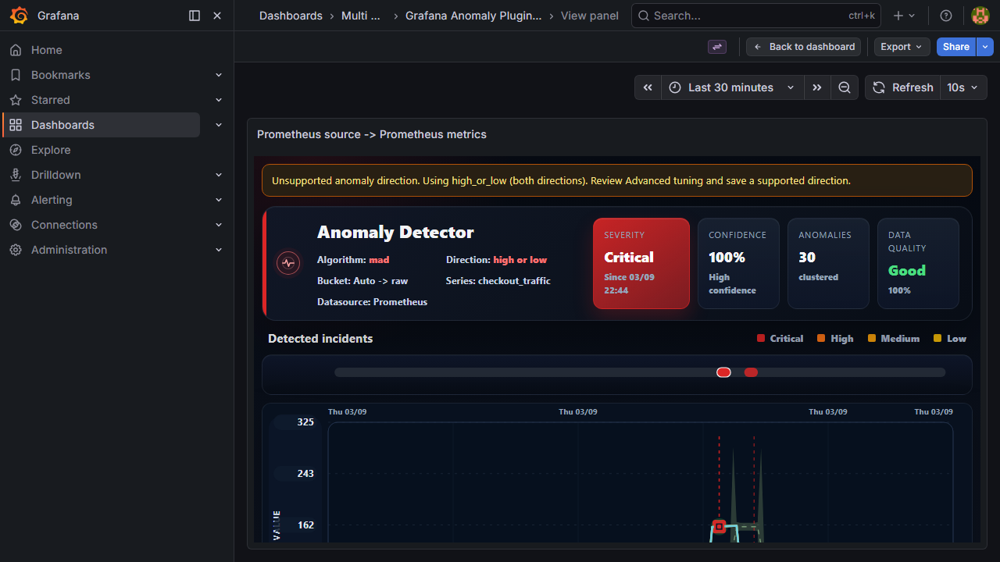

# v1.5.0 Bağımsız Retest ve Kontrollü Düzeltmeler

Tarih: 2026-09-03. İncelenen başlangıç commit'i: `50e79e9`.
Plugin **1.5.0**, exporter **1.5.0**, API schema **3** korunmuştur.

## Karar

Raporun doğrulanan yazılım hataları ve demo/test konfigürasyonu sorunları düzeltildi.
Bu çalışma **koşulsuz üretim onayı değildir**. Sıkı sentetik kalite kontrolü hâlâ
başarısızdır; gerçek etiketli saha verisi ile kalibrasyon ayrıca gereklidir.
Kaynak düzeltmeleri yerel laboratuvara uygulanmıştır. GitHub tag'i, yayımlanmış
ZIP dosyaları ve sürüm numaraları bu çalışma kapsamında değiştirilmemiştir.

## Bulguların Karşılaştırması

| Bulgu | Bağımsız değerlendirme | İşlem |
| --- | --- | --- |
| Demo kısa spike'ları kaçırıyor | Doğrulandı. Ancak yalnız persistence değişikliği yeterli değil; zaman bucket'ı ortalaması da kısa olayı bastırıyor. | Yalnız demo için 5 saniyelik örnekleme, ham noktalar ve 1-of-1 persistence. |
| `aggregation: max` zaman bucket'ında maksimum alıyor | Doğru değil. Bu alan seri skorlarının kural seviyesindeki birleşimini belirliyor. Zaman bucket'ı ayrı hesaplanıyor. | Algoritma değiştirilmedi; doğru konfigürasyon ve replay testi eklendi. |
| Bilinmeyen yön tüm tespiti susturuyor | TS skorlayıcıda kırmızı testle yeniden üretildi. | Ortak yön normalizasyonu; bilinmeyen değerde iki yönlü fallback ve bileşene ham hatalı değer ulaştığında uyarı. |
| Exporter yön paritesi | API/config zaten sıkı doğrulama yapıyor; doğrudan model oluşturma da korunmalı. | Modelde aynı normalizasyon. API/config reddetme davranışı gevşetilmedi. |
| DELETE ham Python hata metni | Doğrulandı. | Pozitif tamsayı kontrolü ve alan adını belirten sabit 400 mesajı. |
| Precision/F1 ve hard seasonal recall kapıda yok | Doğrulandı. Ayrıca eski F1 hesabında iki farklı ölçüm birimi karıştırılmış. | Nokta F1'i düzeltildi; sıkı kontrol ve açıkça isimlendirilmiş regresyon modu ayrıldı. |
| Canlı olay varsayan iki E2E testi kırılgan | Doğrulandı. Hiç olay olmaması tek başına UI hatası değildir. | UI aksiyonları için deterministik veri; gerçek tespit için ayrı replay. |
| Anlamlı grafik SVG'leri isimsiz | Yeniden üretilemedi. Ana grafik ve olay şeridi zaten erişilebilir isim taşıyor. | Gereksiz ürün değişikliği yapılmadı; altı panelde isim/rol doğrulaması eklendi. Dekoratif ikonlar grafik sayılmadı. |
| Exporter 41/42 test | Tam kaynak ağacıyla ürün hatası çıkmadı. | Yeni testlerle 44/44; ayrıca Python 3.9.25 üzerinde 44/44. |
| Seasonal/level_shift yeniden tasarlanmalı | Kalite açığı gerçek; önerilen algoritma değişikliğinin saha yararı bu corpus ile kanıtlanamaz. | Matematik değiştirilmedi; açık kalibrasyon konusu olarak korundu. |
| Gerçek TEAM-BIP corpus testi | Veri bu laboratuvarda yok. | Doğrulanmadı; kapatılmadı. |

## Ürün Düzeltmelerinin Sınırları

### Yön doğrulaması

- `high_mean`, `low_mean`, `high_or_low` desteklenir.
- Çevre boşlukları temizlenir; büyük/küçük harf normalize edilir.
- Eksik veya null değer, önceki varsayılan olan `high_or_low` olur.
- `both`, `upper`, boş dize veya yazım hatası artık TS skorlayıcıyı susturmaz.
- Advanced/custom modda bileşene geçersiz yön gelirse görünür uyarı üretilir.
- Feed kaydına normalize edilmiş yön gönderilir.
- Doğrudan Python modelinde geçersiz yön fallback ve log üretir. Kullanıcıya açık
  config/API doğrulaması ise hatalı değeri reddetmeye devam eder.
- Yön, persistence, warm-up, recovery, cooldown ve skor alanları dahil genişletilmiş
  TS/Python karşılaştırması **3.801 nokta**, **60.816 alan**, tolerans **1e-6** ile geçti.

Uyarı için gizli eski öneri stili kullanılmadı; ayrı, görünür ve uzun metni saran
bir stil eklendi. Aşağıdaki ekran görüntüsü değiştirilmiş gerçek dashboard kaydı
değil, tarayıcıya verilen kontrollü hatalı konfigürasyon fixture'ıdır.



### DELETE sözleşmesi

`panelId=notanumber`, boş, negatif, ondalık ve sıfır değerler sınandı.
Yanıt 400 ve `panelId must be a positive integer.` olur. Python dönüşüm istisnası
istemciye taşınmaz. Hata zarfı ve request-id sözleşmesi korunur.

## Demo Tespiti

Üç statik `checkout_*` kuralı demo üreticisinin 16–18 saniyelik pulse'larına göre
ayarlandı. **Üretim recommended profilindeki 3-of-4 varsayılanı değiştirilmedi.**

| Alan | Demo son durumu |
| --- | --- |
| Query step | 5 saniye |
| Bucket | 0: ham örnekler |
| Persistence | 1-of-1 |
| Latency | MAD; threshold 4.0 |
| Traffic | EWMA; threshold 3.5, recovery 2.625 |
| Error rate | MAD; threshold 4.2 |
| Recovery/cooldown/veri kalitesi | Korundu |

`scripts/demo_detection_check.py` gerçek sentetik üreticiyi ve checked-in demo
kurallarını kullanır: 3 farklı başlangıç fazı × 3 metrik × 2 instance = **18 vaka**.

| Metrik | Olay recall aralığı | Katı nokta precision aralığı |
| --- | --- | --- |
| Latency | 0.947–1.000 | 0.459–0.632 |
| Traffic | 0.842–1.000 | 0.547–0.714 |
| Error rate | 1.000 | 0.704–0.800 |

18/18 demo kontrolü geçti. Recovery sırasında açık tutulan noktalar gerçek pulse
dışına taşabilir; bu nedenle olay yakalama ile nokta precision ayrı raporlanır.
Raporun precision=1.00 iddiası bu ölçüm tanımıyla yeniden doğrulanmadı.

Yeni config ile canlı Prometheus'un son 5 dakikalık maksimum kural skorları
latency=100, traffic=75, error=100 olarak gözlendi. Bu, canlı skor üretiminin
kanıtıdır; mail teslimi veya tüm kuralların score>90 alarmına girmesi anlamına gelmez.

## Kalite Kontrolü Neden Hâlâ Başarısız?

Eski hesap `point precision` ve `event recall` değerlerini aynı F1 formülüne
koyuyordu. Yeni nokta F1'i yalnız nokta precision ve nokta recall kullanır.
Bu yüzden önceki rapordaki F1 sayılarıyla doğrudan karşılaştırılamaz.

| Senaryo/algoritma | Olay recall | Nokta precision | Düzeltilmiş nokta F1 |
| --- | --- | --- | --- |
| clear/zscore | 1.00 | 0.33 | 0.11 |
| clear/mad | 1.00 | 0.25 | 0.19 |
| clear/ewma | 1.00 | 0.58 | 0.35 |
| clear/seasonal | 0.80 | 0.60 | 0.70 |
| clear/level_shift | 1.00 | 0.50 | 0.65 |
| hard/zscore | 0.80 | 0.67 | 0.10 |
| hard/mad | 0.80 | 0.29 | 0.13 |
| hard/ewma | 0.80 | 0.67 | 0.15 |
| hard/seasonal | 0.20 | 0.27 | 0.07 |
| hard/level_shift | 0.60 | 0.75 | 0.72 |

Varsayılan sıkı sentetik kontrol: clear event recall >=0.8, hard >=0.6,
point precision >=0.7 ve point F1 >=0.6. Bunlar muhafazakâr mühendislik kontrol
eşikleridir; müşteri iş-kabul kriterleri veya bütün algoritmaların bütün olay
türlerine uygun olduğunun iddiası değildir. Mevcut corpus noktasal spike ile
sürekli kaymayı birlikte içerir; olay başlangıcını yakalayan bir algoritmanın
uzun kaymadaki her noktayı işaretlemesi ayrıca değerlendirilmelidir.

Sıkı kontrol **exit 1** üretir; `--regression-only` eski karşılaştırma sınırlarıyla
**exit 0** üretir ve açıkça **NOT production acceptance** yazar. Üç yeni gate testi,
düşük seasonal recall veya precision/F1'in sessizce geçmesini engeller.

`clear/level_shift` arka plan FP oranı 0.048 olarak yeniden ölçüldü. Bu değeri
tek veri setine özel bir eşikle düşürüp saha başarısı ilan edilmedi.

## Test Kapsamı

| Kontrol | Sonuç |
| --- | --- |
| Jest | 35/35 |
| Exporter, Python 3.12 imajı / tam checkout | 44/44 |
| Exporter, Python 3.9.25 / tam checkout | 44/44 |
| Kalite gate birim testleri | 3/3 |
| TS/Python genişletilmiş parite | 3.801 nokta; sapma yok |
| Demo pulse replay | 18/18 |
| TypeScript / production build | Geçti |
| ESLint | 0 hata; önceden mevcut 3 TimeZone deprecation uyarısı |
| Son Playwright turu, Grafana 12.4.0 | 18 başarılı, 1 atlandı (auth dahil); görünür yön uyarısı testi dahil |
| Grafana 11.6.7 temel uyumluluk turu | 2/2 (auth + yön fallback/görünür uyarı/grafik/olay tespiti); tam altı-datasource matrisi değildir |
| Eski TestData testi | Dashboard bu stack'te kurulu olmadığı için atlandı |
| Sıkı sentetik kalite | FAIL; açık bulgular yukarıda |
| Tarihsel kalite regresyonu | PASS; üretim onayı değil |

Altı kaynak/hedef UI yolu: Prometheus→Prometheus, Loki→Loki, InfluxDB→InfluxDB,
PostgreSQL→Elasticsearch, ClickHouse→ClickHouse, Elasticsearch→PostgreSQL.
Her panelde olay seçme/inspector, grafiğin erişilebilir adı, annotation oluşturma,
sync, hedefe uygun sorgu, clipboard ve alert builder URL/sorgu aktarımı sınandı.
Builder testi otomatik alarm kaydetmez ve bildirim göndermez.

UI fixture backend isteğini gerçekten yürütür, hata yanıtlarını başarıya çevirmez;
mevcut frame'lerin sayısal değer/zaman dizilerini kontrollü test geçmişiyle değiştirir.
Seyrek/tag bazında bölünmüş frame'lerde de yeterli test geçmişi sağlanır. Bu testler
kaynak doğruluğu veya canlı panel/exporter paritesi diye sunulmaz. Oluşturulan yeni
fixture annotation'ları test bitiminde kendi ID'leriyle temizlenir.

## Yerel Son Durum ve Koruma

- Grafana 12.4.0 sağlık sonucu `database=ok`; exporter `ready=true`,
  `dependenciesHealthy=true`; beş dış sink'in tamamı `up=1` ve son kontrolde
  yeniden başlatma sonrasındaki hata sayıları sıfır.
- Plugin'in derlenen `module.js` dosyası ile Grafana'nın servis ettiği dosya aynı
  SHA-256'ya sahiptir: `4dc111b92a4a2cbdc62d8c0c427c87f4dde76b78b6b9ef810f99388b026676f8`.
- Değişen exporter `models.py` ve `server.py` dosyaları container ile kaynakta
  SHA-256 bazında eşlendi.
- Kullanıcının başlangıç dynamic registry dosyası yedeklendi ve exporter durmuşken
  test sonunda birebir geri yüklendi; hash eşitliği doğrulandı. Yeniden başlatmadan
  sonra normal TTL temizliği iki eski runtime kaydını düşürdü; altı aktif kayıt kaldı.
  Süresi dolmuş kayıtların ömrü yapay olarak uzatılmadı.
- Geçici Grafana 11.6.7 test container'ı kapatılıp kaldırıldı. Ana dokuz container
  çalışır bırakıldı. Kullanıcının mevcut kök QA raporları değiştirilmedi.
- Birincil yerel test kanıtları `output/v150-retest-20260903-223349/` altındadır.
  Bu klasör registry ve oturum yedekleri de içerdiğinden GitHub'a yüklenmemelidir.

## Tekrar Çalıştırma

Repo kökünde uygun Python ortamıyla:

```bash
python -m unittest discover -s scripts -p test_detection_quality_check.py -v
python scripts/parity_check.py
python scripts/demo_detection_check.py
python scripts/detection_quality_check.py --regression-only
python scripts/detection_quality_check.py
npm --prefix grafana-anomaly-detector-panel run test:ci -- --silent
npm --prefix grafana-anomaly-detector-panel run typecheck
npm --prefix grafana-anomaly-detector-panel run lint
npm --prefix grafana-anomaly-detector-panel run build
```

Exporter testleri için exporter dizininin import yolunda olması gerekir; en basit
çalıştırma `prometheus-live-demo/anomaly_exporter` içinde `python -m unittest discover
-s tests -v` komutudur. Parite testi plugin'in kurulu Node bağımlılıklarını kullanır.

Tarayıcı testi plugin dizininden, yerel laboratuvar URL'si ve yetkili test hesabı
environment değişkenleriyle `npx playwright test --project=chromium --workers=1`.
Testler sync/annotation API'lerini kullandığı için üretimde çalıştırılmamalıdır.

## Açık Kalanlar

- Etiketli saha corpus'u ve metrik bazlı kalibrasyon olmadan üretim tespit başarısı
  ilan edilemez. Özellikle seasonal hard ve level_shift FP dengesi açık kalır.
- Bu tur 24 saat soak, gerçek mail/webhook teslimi veya tüm kaynak×hedef
  kombinasyonlarının kesinti testi değildir.
- Yerel test düzeltmeleri yayımlanmış v1.5.0 ZIP'lerinin içerisine otomatik olarak
  girmez. Yayın/paketleme ayrı ve izlenebilir bir işlem olmalıdır; tag taşınmadı.
